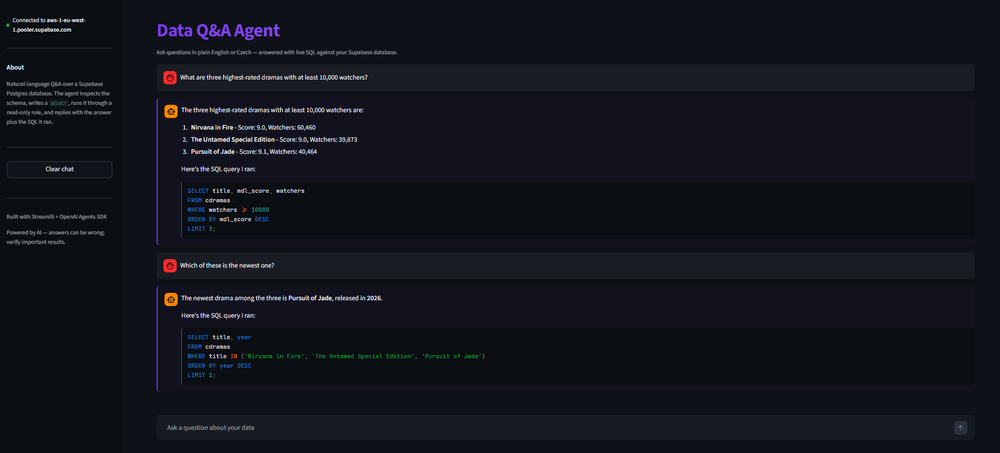

# text-to-sql

Ask questions about a database in plain English (or Czech) and get answers — no SQL knowledge required. The agent reads your database, writes a query, runs it, and replies with both the answer and the SQL it used so you can double-check.

It connects through a read-only role, so it physically cannot change or delete anything in your database — even if the model misbehaves.

<a href="docs/app_history.png" target="_blank" rel="noopener noreferrer"></a>

## What you can ask

- "List the tables you can see."
- "What are three highest-rated dramas with at least 10,000 watchers?"
- "Které drama má nejvíc epizod?" (Czech works too — answer comes back in Czech.)
- "Delete all rows from cdramas." — politely declined, and physically blocked at the database.

## Setup

Prerequisites:
- Python 3.12
- [uv](https://docs.astral.sh/uv/)
- An OpenAI API key
- A Supabase project with at least one table in the `public` schema

```bash
uv sync
cp .env.example .env
```

Then, **once per Supabase project**, create the read-only role:

1. Open your project's SQL editor in Supabase Studio.
2. Open `supabase/setup_readonly_role.sql`, replace `CHANGE_ME_BEFORE_RUNNING` with a strong password, paste, and run.
3. In Studio, click **Connect** → **Transaction pooler** and copy the URI. Replace the username with `agent_readonly.<project-ref>` and substitute the password you just set.
4. Put `OPENAI_API_KEY` and `SUPABASE_DB_URL` into `~/secrets/.env` (preferred) or the local `.env`.

## Usage

### Streamlit UI

```bash
uv run streamlit run app.py
```

The sidebar shows which Supabase project you're connected to. Type questions in the chat input, or click an example to get started.

### Command line

```bash
uv run python -m src.cli "list the tables you can see"
```

One question per invocation; the answer prints to stdout with the SQL the agent ran appended in a fenced code block.

### Tests

```bash
uv run pytest                 # fast: unit tests only
uv run pytest -m llm          # LLM evals (needs OPENAI_API_KEY, slow, costs money)
uv run pytest -m live_db      # DB safety check (needs SUPABASE_DB_URL)
```

## How it works

When you ask a question, the agent:

1. Looks up your database schema — which tables exist and what columns they have.
2. Writes a `SELECT` query to answer the question.
3. Runs the query against Supabase through a read-only connection.
4. If the query errors, reads the error and tries again (capped at 10 turns so a buggy run can't spiral).
5. Replies with the answer and the SQL it used.

The agent doesn't have a "delete" or "update" tool — only three exist: list tables, describe a table, and run a SELECT. There's nothing in its toolbox that *could* modify data, regardless of what the model decides to do.

One small detail worth noting: vector columns (in this dataset, the 3072-dim `embedding` column on `cdramas`) are filtered out of `describe_table` and query results so they never reach the model. They'd burn a huge amount of context for no benefit — the model can't do anything useful with raw embedding numbers.

## Why it can't break your database

Three layers of safety, deepest first:

1. **The database itself.** The connection uses a Postgres role (`agent_readonly`) with only `SELECT` permission on the `public` schema. A `DELETE` would fail with `permission denied for table` even if everything above this layer were broken.
2. **The tool layer.** Only `list_tables`, `describe_table`, and `run_select_query` exist as tools. `run_select_query` additionally rejects anything whose first non-comment token isn't `SELECT`/`WITH`, and rejects multi-statement input.
3. **The system prompt.** Tells the agent to only write SELECTs and decline off-topic questions.

The first layer is the only one that strictly matters — the others just keep the model on the happy path.

## Not production-grade

This is a portfolio project. Things I'd do differently for production:

- `agent_readonly` is created with `BYPASSRLS` for simplicity. For a real multi-tenant app, drop that line and write RLS policies — otherwise the agent can read every row in every table regardless of ownership.
- The whole schema fits in a single prompt because the demo DB is small. At ~100 tables you'd need schema embedding + retrieval rather than dumping the whole schema.
- Result sets larger than 200 rows are truncated. A real app would paginate or summarize server-side.
- No adversarial-input hardening beyond the read-only enforcement above. Don't point this at a database with sensitive data.
- Not a replacement for serious text-to-SQL tools like Vanna or Dataherald.

## Why there's no live demo

The demo dataset was scraped from MyDramaList, and redistributing it via a public URL isn't something I want to do. The code runs locally against your own Supabase project just fine; if you want a deployable version, swap the dataset for something with a permissive license (e.g. Chinook, or your own data). The agent itself is schema-agnostic — it introspects the database every run — so you'd just need to update the example questions in `app.py` to match the new schema.

## How MCP fits in

[MCP (Model Context Protocol)](https://modelcontextprotocol.io/) is an open protocol that lets LLM applications plug into external tools and data sources. It defines a small client/server contract:

- An **MCP server** exposes a set of tools over a standard interface (usually stdio or HTTP). It doesn't talk to an LLM directly — it just answers tool calls.
- An **MCP client** runs inside the LLM application (Claude Desktop, an IDE plugin, an agent framework). It connects to one or more servers and surfaces their tools to the model.

In this project, the three tools (`list_tables`, `describe_table`, `run_select_query`) live in `src/mcp_server.py` as a FastMCP server. The OpenAI Agents SDK ships its own MCP client; on each run, the agent spawns that server as a subprocess and talks to it over stdio.

The agent only sees a tool list — it doesn't know the implementations live in another process. That decouples the tool layer from the agent (and from the LLM provider), and means the server is a standard MCP implementation rather than a custom one built just for this app.

## Tech stack

- Python 3.12, [uv](https://docs.astral.sh/uv/)
- [`openai-agents`](https://openai.github.io/openai-agents-python/) — the OpenAI Agents SDK (with its built-in MCP client), running `gpt-4o-mini`
- [`mcp`](https://modelcontextprotocol.io/) — the Python MCP SDK; the agent's tools live in a FastMCP server it spawns as a subprocess
- `asyncpg` — async Postgres driver
- Supabase — hosted Postgres + the `agent_readonly` role for safety
- `streamlit` for the chat UI
- `python-dotenv` for the API key

## Project layout

```
text-to-sql/
├── src/
│   ├── prompts.py      # system instructions, kept separate for easy iteration
│   ├── db.py           # asyncpg connection + introspection SQL + SELECT-only guard
│   ├── sql_tools.py    # the three async tool implementations
│   ├── mcp_server.py   # FastMCP server exposing sql_tools over stdio
│   ├── agent.py        # spawns mcp_server as a subprocess + run_question()
│   └── cli.py          # argv -> asyncio.run(run_question(...))
├── supabase/
│   └── setup_readonly_role.sql   # one-shot role + grants for the agent
├── tests/
│   └── test_db.py      # unit tests for the SELECT-only guard
├── app.py              # Streamlit UI
├── pyproject.toml
└── .env.example
```
